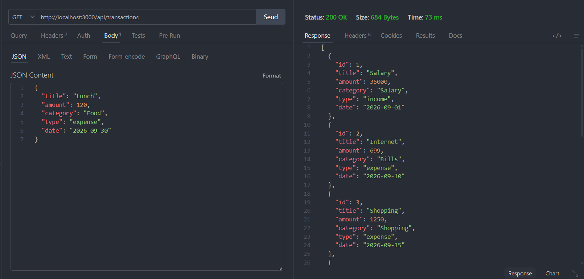
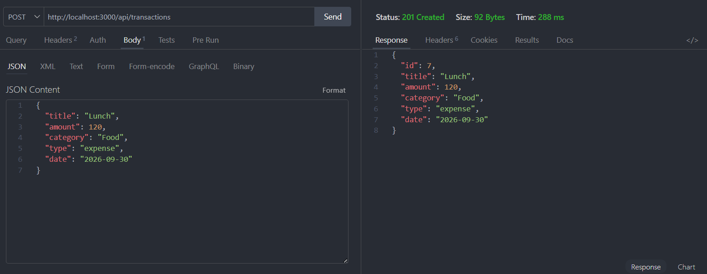
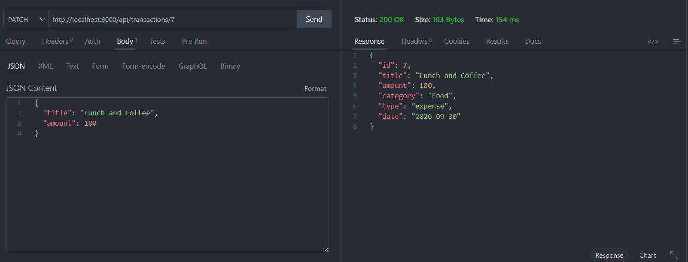
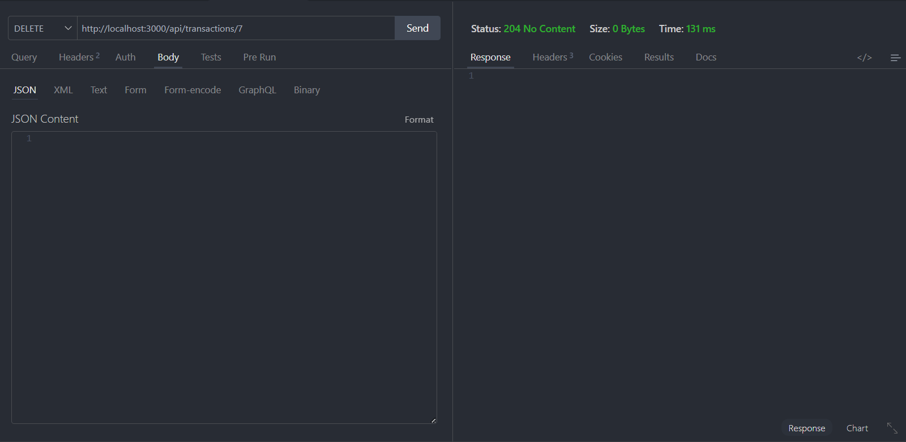
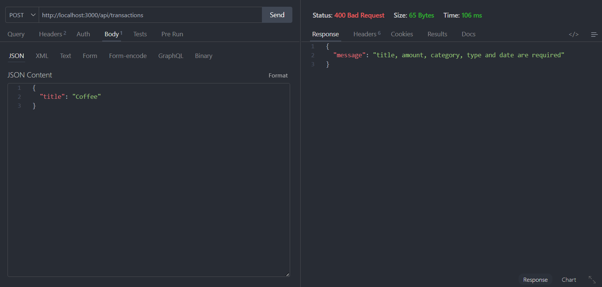
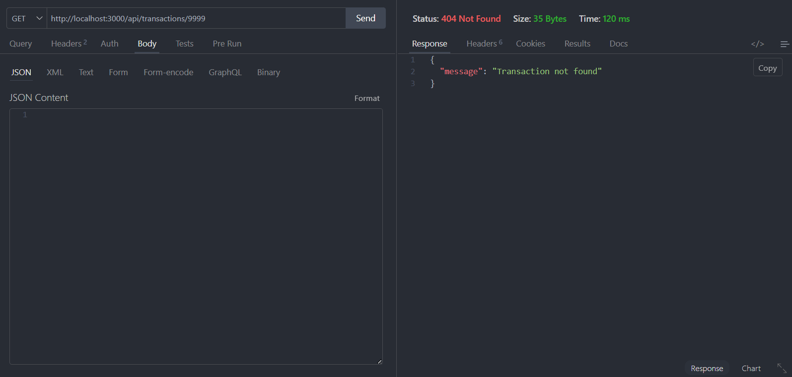

# MoneyMate — Personal Finance Tracker

MoneyMate คือเว็บแอปพลิเคชันสำหรับจัดการรายรับ–รายจ่ายส่วนบุคคล พัฒนาด้วย HTML, CSS, JavaScript, Node.js และ Express.js

ระบบช่วยให้ผู้ใช้สามารถบันทึก แก้ไข ลบ และค้นหารายการธุรกรรม ดูภาพรวมทางการเงินผ่าน Dashboard และ Charts วิเคราะห์ค่าใช้จ่าย ดูรายการตามวันที่ผ่าน Calendar รวมถึงสร้างเป้าหมายการออมและเพิ่มเงินเข้าสู่เป้าหมายเดิมได้

โปรเจกต์นี้พัฒนาในรูปแบบ Full-Stack Web Application โดย Frontend ติดต่อกับ Backend ผ่าน REST API

---

# Features

## 1. Dashboard

Dashboard ใช้สำหรับแสดงภาพรวมทางการเงินของผู้ใช้

สามารถแสดง

- Current Balance
- Total Income
- Total Expense
- Saving Rate
- Expense Breakdown
- Year Overview
- Recent Transactions
- Add Transaction

ระบบจะดึงข้อมูล Transaction จาก Backend ผ่าน

```http
GET /api/transactions
```

และนำข้อมูลมาคำนวณยอดรวมและสร้างกราฟด้วย Chart.js

---

## 2. Transactions

หน้า Transactions ใช้สำหรับจัดการข้อมูลรายรับและรายจ่าย

รองรับ

- เพิ่ม Transaction
- แก้ไข Transaction
- ลบ Transaction
- ค้นหา Transaction
- Filter ตาม Income / Expense
- แสดง Total Income
- แสดง Total Expense
- แสดง Balance

Transaction แต่ละรายการประกอบด้วย

```text
Title
Amount
Category
Type
Date
```

ตัวอย่างข้อมูล

```json
{
  "id": 1,
  "title": "Coffee",
  "amount": 80,
  "category": "Food",
  "type": "expense",
  "date": "2026-09-24"
}
```

---

## 3. Analytics

หน้า Analytics ใช้สำหรับวิเคราะห์ข้อมูลทางการเงินจาก Transaction

ระบบสามารถแสดง

- Total Expense
- Saving Rate
- Average Expense
- Category Breakdown
- Monthly Expense Trend
- Financial Insight

Chart ใช้ Chart.js ในการแสดงข้อมูลแบบ

```text
Doughnut Chart
Line Chart
Bar Chart
```

---

## 4. Budget & Goals

หน้า Budget & Goals ใช้สำหรับสร้างและติดตามเป้าหมายการออม

ผู้ใช้สามารถกำหนด

```text
Goal Name
Target Amount
Current Saving
```

ตัวอย่าง

```text
Goal Name: New Laptop
Target Amount: 30,000
Current Saving: 5,000
```

ระบบจะคำนวณ Progress อัตโนมัติ

```text
Current Saving ÷ Target Amount × 100
```

ตัวอย่าง

```text
5,000 ÷ 30,000 × 100
= 16.67%
```

ระบบจะแสดง Progress Bar และเปอร์เซ็นต์ของเป้าหมาย

### Add Saving

สามารถเพิ่มเงินเข้า Goal เดิมได้โดยกด

```text
Add Saving
```

ตัวอย่าง

```text
Current Saving
฿5,000

Add Saving
฿3,000
```

ผลลัพธ์

```text
฿8,000 / ฿30,000
```

Progress จะอัปเดตทันที

หากยอดเงินถึง Target ระบบจะแสดงสถานะ

```text
Goal completed
```

ข้อมูล Goals จะถูกบันทึกด้วย LocalStorage

ดังนั้นข้อมูลจะยังอยู่หลังจาก Refresh หน้าเว็บ

---

## 5. Calendar

หน้า Calendar ใช้สำหรับดู Transaction ตามวันที่

รองรับ

- เปลี่ยนเดือน
- กลับไปวันที่ปัจจุบัน
- แสดงวันที่ที่มี Transaction
- กดวันที่เพื่อดู Transaction
- Income ของเดือน
- Expense ของเดือน
- Net Balance ของเดือน

วันที่ที่มี Transaction จะแสดง Indicator บน Calendar

เมื่อกดวันที่ ระบบจะแสดง Transaction ของวันนั้น

ตัวอย่าง

```text
30 September 2026

Lunch
Food
-฿120
```

---

## 6. Settings

หน้า Settings ใช้สำหรับตั้งค่าหน้าตาของระบบ

รองรับ Theme จำนวน 4 รูปแบบ

```text
Cloud
Midnight
Forest
Lavender
```

Theme จะถูกบันทึกด้วย LocalStorage

ดังนั้นเมื่อ Refresh หน้าเว็บ Theme จะยังคงอยู่

Appearance สามารถเปลี่ยนได้จากหน้า Settings

---

# Technologies Used

## Frontend

- HTML5
- CSS3
- JavaScript
- Chart.js
- Phosphor Icons
- LocalStorage

## Backend

- Node.js
- Express.js
- REST API
- JSON
- Node.js File System (`fs`)

## Development Tools

- Visual Studio Code
- npm
- Git
- GitHub
- Thunder Client
- Browser Developer Tools

---

# Project Structure

```text
Mini-project-MoneyMate/
│
├── public/
│   ├── index.html
│   ├── transactions.html
│   ├── analytics.html
│   ├── budget.html
│   ├── calendar.html
│   ├── settings.html
│   ├── style.css
│   └── script.js
│
├── server/
│   ├── app.js
│   ├── package.json
│   ├── package-lock.json
│   └── transactions.json
│
├── screenshots/
│   ├── get-transactions.png
│   ├── post-transaction.png
│   ├── patch-transaction.png
│   ├── delete-transaction.png
│   ├── error-400.png
│   └── error-404.png
│
├── README.md
└── report.pdf
```

---

# Installation

## 1. Clone Repository

```bash
git clone https://github.com/Yin-Yew/Mini-project-MoneyMate.git
```

---

## 2. เข้าโฟลเดอร์โปรเจกต์

```bash
cd Mini-project-MoneyMate
```

---

## 3. เข้าโฟลเดอร์ Server

```bash
cd server
```

---

## 4. Install Dependencies

```bash
npm install
```

คำสั่งนี้จะติดตั้ง Express และสร้างโฟลเดอร์

```text
node_modules
```

รวมถึงสร้างหรืออัปเดต

```text
package-lock.json
```

---

## 5. Run Server

```bash
npm run dev
```

หรือ

```bash
npm start
```

เมื่อ Server ทำงานสำเร็จ Terminal จะแสดง

```text
MoneyMate server running at http://localhost:3000
```

---

# Open Website

เปิด Browser แล้วเข้า

```text
http://localhost:3000
```

Frontend จะถูก Serve ผ่าน Express จากโฟลเดอร์

```text
public/
```

เมื่อรวม Frontend และ Backend แล้ว ไม่จำเป็นต้องใช้ Live Server

---

# REST API

Base URL

```text
http://localhost:3000/api
```

---

## GET All Transactions

ใช้สำหรับดึง Transaction ทั้งหมด

```http
GET /api/transactions
```

ตัวอย่าง Response

```json
[
  {
    "id": 1,
    "title": "Salary",
    "amount": 35000,
    "category": "Salary",
    "type": "income",
    "date": "2026-09-01"
  },
  {
    "id": 2,
    "title": "Internet",
    "amount": 699,
    "category": "Bills",
    "type": "expense",
    "date": "2026-09-10"
  }
]
```

Status

```text
200 OK
```

---

# GET Transaction by ID

ใช้สำหรับค้นหา Transaction ตาม ID

```http
GET /api/transactions/:id
```

ตัวอย่าง

```http
GET /api/transactions/1
```

เมื่อพบข้อมูล

```text
200 OK
```

หากไม่พบข้อมูล

```text
404 Not Found
```

ตัวอย่าง Response

```json
{
  "message": "Transaction not found"
}
```

---

# Query String

ระบบรองรับการ Filter Transaction ผ่าน Query String

## Filter ตาม Type

```http
GET /api/transactions?type=expense
```

หรือ

```http
GET /api/transactions?type=income
```

---

## Filter ตาม Category

```http
GET /api/transactions?category=Food
```

ตัวอย่าง

```http
GET /api/transactions?category=Shopping
```

---

## Filter ตาม Month

```http
GET /api/transactions?month=9
```

---

## Filter ตาม Year

```http
GET /api/transactions?year=2026
```

---

# POST Transaction

ใช้สำหรับสร้าง Transaction ใหม่

```http
POST /api/transactions
```

Request Body

```json
{
  "title": "Lunch",
  "amount": 120,
  "category": "Food",
  "type": "expense",
  "date": "2026-09-30"
}
```

หากสร้างสำเร็จ

```text
201 Created
```

ตัวอย่าง Response

```json
{
  "id": 7,
  "title": "Lunch",
  "amount": 120,
  "category": "Food",
  "type": "expense",
  "date": "2026-09-30"
}
```

---

# PATCH Transaction

ใช้สำหรับแก้ไขข้อมูล Transaction

```http
PATCH /api/transactions/:id
```

ตัวอย่าง

```http
PATCH /api/transactions/7
```

Request Body

```json
{
  "title": "Lunch and Coffee",
  "amount": 180
}
```

หากแก้ไขสำเร็จ

```text
200 OK
```

ตัวอย่าง Response

```json
{
  "id": 7,
  "title": "Lunch and Coffee",
  "amount": 180,
  "category": "Food",
  "type": "expense",
  "date": "2026-09-30"
}
```

หากไม่พบ ID

```text
404 Not Found
```

---

# DELETE Transaction

ใช้สำหรับลบ Transaction

```http
DELETE /api/transactions/:id
```

ตัวอย่าง

```http
DELETE /api/transactions/7
```

หากลบสำเร็จ

```text
204 No Content
```

Response จะไม่มี Body

---

# Validation

Backend จะตรวจสอบข้อมูลก่อนเพิ่มหรือแก้ไข Transaction

ข้อมูลหลักประกอบด้วย

```text
title
amount
category
type
date
```

`amount` ต้องเป็นตัวเลขที่มากกว่า

```text
0
```

`type` ต้องเป็น

```text
income
```

หรือ

```text
expense
```

Category ที่รองรับ

```text
Food
Transport
Shopping
Bills
Entertainment
Salary
Other
```

Date ใช้รูปแบบ

```text
YYYY-MM-DD
```

---

# Error Handling

## 400 Bad Request

หากส่งข้อมูลไม่ครบ เช่น

```json
{
  "title": "Coffee"
}
```

Server จะตอบกลับ

```text
400 Bad Request
```

พร้อม Response

```json
{
  "message": "title, amount, category, type and date are required"
}
```

---

## 404 Not Found

ตัวอย่าง Request

```http
GET /api/transactions/9999
```

หากไม่มี Transaction ID ดังกล่าว ระบบจะตอบ

```text
404 Not Found
```

Response

```json
{
  "message": "Transaction not found"
}
```

---

# HTTP Status Codes

| Status Code | Description |
|---|---|
| `200 OK` | GET หรือ PATCH สำเร็จ |
| `201 Created` | POST สำเร็จ |
| `204 No Content` | DELETE สำเร็จ |
| `400 Bad Request` | ข้อมูลไม่ถูกต้องหรือไม่ครบ |
| `404 Not Found` | ไม่พบ Transaction |
| `500 Internal Server Error` | Server เกิดข้อผิดพลาด |

---

# API Testing

REST API ถูกทดสอบด้วย Thunder Client

ผลการทดสอบที่ผ่านแล้ว

```text
GET       200 OK
POST      201 Created
PATCH     200 OK
DELETE    204 No Content
400       Bad Request
404       Not Found
```

---

# GET Test

Request

```http
GET http://localhost:3000/api/transactions
```

ผลลัพธ์

```text
200 OK
```

Screenshot

```markdown

```

---

# POST Test

Request

```http
POST http://localhost:3000/api/transactions
```

ผลลัพธ์

```text
201 Created
```

Screenshot

```markdown

```

---

# PATCH Test

Request

```http
PATCH http://localhost:3000/api/transactions/7
```

ผลลัพธ์

```text
200 OK
```

Screenshot

```markdown

```

---

# DELETE Test

Request

```http
DELETE http://localhost:3000/api/transactions/7
```

ผลลัพธ์

```text
204 No Content
```

Screenshot

```markdown

```

---

# 400 Validation Test

ผลลัพธ์

```text
400 Bad Request
```

Screenshot

```markdown

```

---

# 404 Error Test

Request

```http
GET http://localhost:3000/api/transactions/9999
```

ผลลัพธ์

```text
404 Not Found
```

Screenshot

```markdown

```

---

# Frontend and Backend Connection

Frontend ติดต่อ Backend ผ่าน Fetch API

ตัวอย่าง GET

```javascript
fetch("/api/transactions")
```

ตัวอย่าง POST

```javascript
fetch("/api/transactions", {
  method: "POST",
  headers: {
    "Content-Type": "application/json"
  },
  body: JSON.stringify(transaction)
});
```

ตัวอย่าง PATCH

```javascript
fetch(`/api/transactions/${id}`, {
  method: "PATCH",
  headers: {
    "Content-Type": "application/json"
  },
  body: JSON.stringify(updatedTransaction)
});
```

ตัวอย่าง DELETE

```javascript
fetch(`/api/transactions/${id}`, {
  method: "DELETE"
});
```

---

# Transaction Data Storage

ข้อมูล Transaction ถูกเก็บในไฟล์

```text
server/transactions.json
```

ตัวอย่าง

```json
[
  {
    "id": 1,
    "title": "Salary",
    "amount": 35000,
    "category": "Salary",
    "type": "income",
    "date": "2026-09-01"
  }
]
```

เมื่อเพิ่ม แก้ไข หรือลบ Transaction ระบบ Backend จะอัปเดตไฟล์ `transactions.json`

---

# LocalStorage

LocalStorage ถูกใช้กับข้อมูลที่เป็นการตั้งค่าฝั่ง Client เช่น

```text
Theme
Budget & Goals
Animation Preference
Notification Preference
Demo Data
```

ตัวอย่าง Key

```text
theme
goals
moneyMateAnimation
moneyMateNotifications
moneyMateDemoTransactions
```

---

# System Workflow

```text
User
 │
 ▼
Frontend
HTML / CSS / JavaScript
 │
 │ Fetch API
 ▼
Express Server
 │
 ▼
REST API
/api/transactions
 │
 ▼
transactions.json
```

ส่วน Budget & Goals ทำงานดังนี้

```text
User
 │
 ▼
Create Goal / Add Saving
 │
 ▼
JavaScript
 │
 ▼
LocalStorage
 │
 ▼
Goal Progress
```

---

# User Interface

MoneyMate ใช้แนวทางการออกแบบแบบ Modern FinTech Dashboard และ Glassmorphism

องค์ประกอบหลักประกอบด้วย

```text
Dashboard
Transactions
Analytics
Budget & Goals
Calendar
Settings
```

ระบบรองรับ Responsive Design สำหรับขนาดหน้าจอที่แตกต่างกัน

---

# Themes

MoneyMate มี Theme จำนวน 4 รูปแบบ

### Cloud

Light Theme สำหรับหน้าจอสว่าง

### Midnight

Dark Blue Theme

### Forest

Dark Emerald Theme

### Lavender

Purple / Pink Theme

Theme สามารถเปลี่ยนได้จาก

```text
Settings → Appearance
```

---

# Demo Mode

หาก Frontend ไม่สามารถเชื่อมต่อกับ

```text
/api/transactions
```

ระบบสามารถใช้ Demo Data จาก LocalStorage เพื่อให้สามารถทดสอบ Frontend ได้

เมื่อเชื่อมต่อ Express Server สำเร็จ ระบบจะใช้ข้อมูลจริงจาก

```text
server/transactions.json
```

---

# GitHub Repository

```text
https://github.com/Yin-Yew/Mini-project-MoneyMate
```

---

# Report

เอกสารรายงานโปรเจกต์อยู่ในไฟล์

```text
report.pdf
```

รายงานประกอบด้วย

```text
Introduction
Objectives
System Design
Project Structure
Frontend Design
Backend Design
REST API
API Testing
Error Handling
Screenshots
Conclusion
```

---

# Conclusion

MoneyMate เป็น Full-Stack Personal Finance Tracker ที่ช่วยให้ผู้ใช้สามารถจัดการข้อมูลรายรับและรายจ่ายผ่านเว็บแอปพลิเคชันได้

ระบบรองรับการเพิ่ม แก้ไข ลบ ค้นหา และ Filter Transaction ผ่าน REST API พร้อมแสดงข้อมูลในรูปแบบ Dashboard, Charts, Analytics และ Calendar

นอกจากนี้ยังมีระบบ Budget & Goals ที่สามารถสร้างเป้าหมายการออม เพิ่มเงินเข้าเป้าหมายเดิม และติดตามความคืบหน้าผ่าน Progress Bar ได้

โปรเจกต์นี้แสดงการประยุกต์ใช้ความรู้เกี่ยวกับ

```text
HTML
CSS
JavaScript
Node.js
Express.js
REST API
HTTP Methods
JSON
LocalStorage
Fetch API
Chart.js
Git
GitHub
```

ในการพัฒนา Full-Stack Web Application
