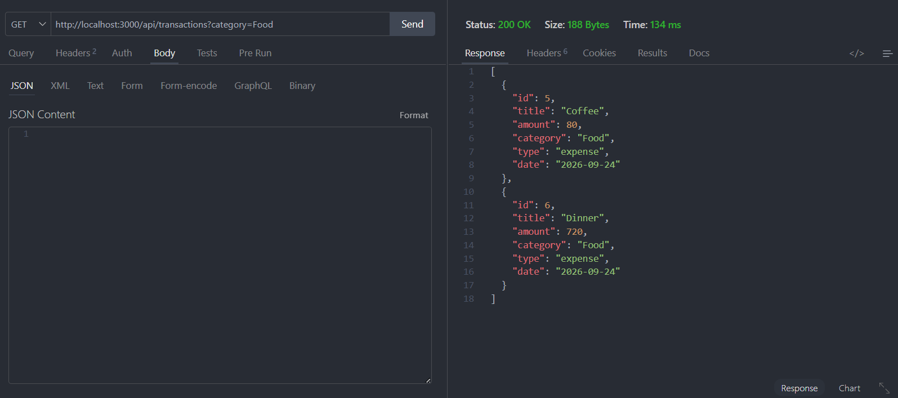

# MoneyMate — Personal Finance Tracker

MoneyMate คือเว็บแอปพลิเคชันสำหรับจัดการรายรับ–รายจ่ายส่วนบุคคล พัฒนาด้วย HTML, CSS, JavaScript, Node.js และ Express.js

ระบบช่วยให้ผู้ใช้สามารถเพิ่ม แก้ไข ลบ ค้นหา และกรองรายการธุรกรรม ดูภาพรวมทางการเงินผ่าน Dashboard และ Charts วิเคราะห์ค่าใช้จ่าย ดูรายการตามวันที่ผ่าน Calendar รวมถึงสร้างและติดตามเป้าหมายการออมได้

โปรเจกต์นี้พัฒนาในรูปแบบ **Full-Stack Web Application** โดย Frontend ติดต่อกับ Backend ผ่าน REST API ของระบบเอง

---

# Features

## 1. Dashboard

Dashboard ใช้สำหรับแสดงภาพรวมทางการเงินของผู้ใช้

สามารถแสดง

- Current Balance
- Total Income
- Total Expense
- Saving Rate
- Expense Breakdown
- Year Overview
- Recent Transactions
- Add Transaction

ระบบดึงข้อมูลจาก Backend ผ่าน

```http
GET /api/transactions
```

จากนั้นนำข้อมูลมาคำนวณและแสดงผลด้วย Chart.js

Dashboard ประกอบด้วย

- Doughnut Chart สำหรับ Expense Breakdown
- Bar Chart สำหรับ Year Overview

---

## 2. Transactions

หน้า Transactions ใช้สำหรับจัดการรายการรายรับและรายจ่าย

รองรับ

- เพิ่ม Transaction
- แก้ไข Transaction
- ลบ Transaction
- ค้นหา Transaction
- Filter ตาม Income / Expense
- แสดง Total Income
- แสดง Total Expense
- แสดง Balance

Transaction แต่ละรายการประกอบด้วย

```text
Title
Amount
Category
Type
Date
```

ตัวอย่างข้อมูล

```json
{
  "id": 1,
  "title": "Coffee",
  "amount": 80,
  "category": "Food",
  "type": "expense",
  "date": "2026-09-24"
}
```

---

## 3. Analytics

หน้า Analytics ใช้สำหรับวิเคราะห์ข้อมูลทางการเงินจาก Transaction

สามารถแสดง

- Total Expense
- Saving Rate
- Average Expense
- Category Breakdown
- Monthly Expense Trend
- Financial Insight

หน้า Analytics ใช้ Chart.js แสดงข้อมูลในรูปแบบ

```text
Doughnut Chart
Line Chart
```

---

## 4. Budget & Goals

หน้า Budget & Goals ใช้สำหรับสร้างและติดตามเป้าหมายการออม

ผู้ใช้สามารถกำหนด

```text
Goal Name
Target Amount
Current Saving
```

ตัวอย่าง

```text
Goal Name: New Laptop
Target Amount: 30,000
Current Saving: 5,000
```

ระบบจะคำนวณ Progress จาก

```text
Current Saving ÷ Target Amount × 100
```

ตัวอย่าง

```text
5,000 ÷ 30,000 × 100
= 16.67%
```

ระบบจะแสดง

- Current Saving
- Target Amount
- Progress Percentage
- Progress Bar
- Remaining Amount

### Add Saving

ผู้ใช้สามารถเพิ่มเงินเข้า Goal เดิมได้โดยกด

```text
Add Saving
```

ตัวอย่าง

```text
Current Saving: ฿5,000
Add Saving: ฿3,000
```

ผลลัพธ์

```text
฿8,000 / ฿30,000
```

Progress จะอัปเดตทันที

เมื่อยอดเงินถึง Target ระบบจะแสดง

```text
Goal completed
```

ข้อมูล Goals ถูกจัดเก็บด้วย LocalStorage

> Budget & Goals ในเวอร์ชันนี้เน้น Saving Goals และยังไม่มีระบบ Monthly Budget แยกตาม Category

---

## 5. Calendar

หน้า Calendar ใช้สำหรับดู Transaction ตามวันที่

รองรับ

- เปลี่ยนเดือน
- กลับไปวันที่ปัจจุบัน
- แสดงวันที่ที่มี Transaction
- กดวันที่เพื่อดู Transaction
- Income ของเดือน
- Expense ของเดือน
- Net Balance ของเดือน

วันที่ที่มี Transaction จะแสดง Indicator บน Calendar

เมื่อกดวันที่ ระบบจะแสดงรายการ Transaction ของวันนั้น

---

## 6. Settings

หน้า Settings ใช้สำหรับตั้งค่าหน้าตาของระบบ

รองรับ Theme จำนวน 4 รูปแบบ

```text
Cloud
Midnight
Forest
Lavender
```

Theme จะถูกบันทึกด้วย LocalStorage

สามารถเปลี่ยน Theme ได้จาก

```text
Settings → Appearance
```

---

# Technologies Used

## Frontend

- HTML5
- CSS3
- JavaScript
- Fetch API
- Chart.js
- Phosphor Icons
- LocalStorage

## Backend

- Node.js
- Express.js
- REST API
- JSON
- Node.js File System (`fs`)

## Development Tools

- Visual Studio Code
- npm
- Git
- GitHub
- Thunder Client
- Browser Developer Tools

---

# Project Structure

```text
Mini-project-MoneyMate/
│
├── public/
│   ├── index.html
│   ├── transactions.html
│   ├── analytics.html
│   ├── budget.html
│   ├── calendar.html
│   ├── settings.html
│   ├── style.css
│   └── script.js
│
├── server/
│   ├── app.js
│   ├── package.json
│   ├── package-lock.json
│   └── transactions.json
│
├── screenshots/
│   ├── get-transactions.png
│   ├── post-transaction.png
│   ├── patch-transaction.png
│   ├── delete-transaction.png
│   ├── error-400.png
│   ├── error-404.png
│   └── query-filter.png
│
├── .gitignore
├── README.md
└── report.pdf
```

---

# Installation

## 1. Clone Repository

```bash
git clone https://github.com/Yin-Yew/Mini-project-MoneyMate.git
```

## 2. เข้าโฟลเดอร์โปรเจกต์

```bash
cd Mini-project-MoneyMate
```

## 3. เข้าโฟลเดอร์ Server

```bash
cd server
```

## 4. Install Dependencies

```bash
npm install
```

คำสั่งนี้จะติดตั้ง Dependencies ที่จำเป็น เช่น Express

## 5. Run Server

```bash
npm run dev
```

หรือ

```bash
npm start
```

เมื่อ Server ทำงานสำเร็จ Terminal จะแสดง

```text
MoneyMate server running at http://localhost:3000
```

---

# Open Website

เปิด Browser แล้วเข้า

```text
http://localhost:3000
```

Frontend ถูก Serve ผ่าน Express จากโฟลเดอร์

```text
public/
```

เมื่อรันผ่าน Express แล้วไม่จำเป็นต้องใช้ Live Server

---

# REST API

Resource หลักของระบบคือ

```text
transactions
```

Base URL

```text
http://localhost:3000/api
```

---

## GET All Transactions

ใช้สำหรับดึง Transaction ทั้งหมด

```http
GET /api/transactions
```

ตัวอย่าง Response

```json
[
  {
    "id": 1,
    "title": "Salary",
    "amount": 35000,
    "category": "Salary",
    "type": "income",
    "date": "2026-09-01"
  },
  {
    "id": 2,
    "title": "Internet",
    "amount": 699,
    "category": "Bills",
    "type": "expense",
    "date": "2026-09-10"
  }
]
```

Status

```text
200 OK
```

---

## GET Transaction by ID

ใช้สำหรับดึง Transaction รายการเดียวด้วย ID

```http
GET /api/transactions/:id
```

ตัวอย่าง

```http
GET /api/transactions/1
```

หากพบข้อมูล

```text
200 OK
```

หากไม่พบข้อมูล

```text
404 Not Found
```

ตัวอย่าง Response

```json
{
  "message": "Transaction not found"
}
```

---

## Query String Filtering

ระบบรองรับการกรองข้อมูลด้วย Query String

### Filter ตาม Type

```http
GET /api/transactions?type=expense
```

หรือ

```http
GET /api/transactions?type=income
```

### Filter ตาม Category

```http
GET /api/transactions?category=Food
```

### Filter ตาม Month

```http
GET /api/transactions?month=9
```

### Filter ตาม Year

```http
GET /api/transactions?year=2026
```

ตัวอย่างการกรองตาม Category

```http
GET /api/transactions?category=Food
```

ผลลัพธ์

```text
200 OK
```

ระบบจะส่งกลับเฉพาะ Transaction ที่มี Category เป็น `Food`



---

## POST Transaction

ใช้สำหรับเพิ่ม Transaction ใหม่

```http
POST /api/transactions
```

Request Body

```json
{
  "title": "Lunch",
  "amount": 120,
  "category": "Food",
  "type": "expense",
  "date": "2026-09-30"
}
```

หากสำเร็จ

```text
201 Created
```

ตัวอย่าง Response

```json
{
  "id": 7,
  "title": "Lunch",
  "amount": 120,
  "category": "Food",
  "type": "expense",
  "date": "2026-09-30"
}
```

---

## PATCH Transaction

ใช้สำหรับแก้ไขข้อมูล Transaction ตาม ID

```http
PATCH /api/transactions/:id
```

ตัวอย่าง

```http
PATCH /api/transactions/7
```

Request Body

```json
{
  "title": "Lunch and Coffee",
  "amount": 180
}
```

หากสำเร็จ

```text
200 OK
```

ตัวอย่าง Response

```json
{
  "id": 7,
  "title": "Lunch and Coffee",
  "amount": 180,
  "category": "Food",
  "type": "expense",
  "date": "2026-09-30"
}
```

หากไม่พบ ID

```text
404 Not Found
```

---

## DELETE Transaction

ใช้สำหรับลบ Transaction ตาม ID

```http
DELETE /api/transactions/:id
```

ตัวอย่าง

```http
DELETE /api/transactions/7
```

หากลบสำเร็จ

```text
204 No Content
```

Response จะไม่มี Body

---

# Validation

Backend ตรวจสอบข้อมูลก่อนเพิ่มหรือแก้ไข Transaction

ข้อมูลหลักประกอบด้วย

```text
title
amount
category
type
date
```

เงื่อนไขหลัก

```text
title ต้องไม่เป็นค่าว่าง
amount ต้องเป็นตัวเลขมากกว่า 0
category ต้องเป็น Category ที่ระบบรองรับ
type ต้องเป็น income หรือ expense
date ต้องอยู่ในรูปแบบ YYYY-MM-DD
```

Category ที่รองรับ

```text
Food
Transport
Shopping
Bills
Entertainment
Salary
Other
```

---

# Error Handling

## 400 Bad Request

หากส่งข้อมูลไม่ครบ เช่น

```json
{
  "title": "Coffee"
}
```

Server จะตอบกลับ

```text
400 Bad Request
```

Response

```json
{
  "message": "title, amount, category, type and date are required"
}
```

---

## 404 Not Found

ตัวอย่าง

```http
GET /api/transactions/9999
```

หากไม่พบ Transaction ID ดังกล่าว

```text
404 Not Found
```

Response

```json
{
  "message": "Transaction not found"
}
```

---

# HTTP Status Codes

| Status Code | Description |
|---|---|
| `200 OK` | GET หรือ PATCH สำเร็จ |
| `201 Created` | POST สำเร็จ |
| `204 No Content` | DELETE สำเร็จ |
| `400 Bad Request` | ข้อมูลไม่ถูกต้องหรือไม่ครบ |
| `404 Not Found` | ไม่พบ Transaction หรือ API Endpoint |

---

# API Testing

REST API ถูกทดสอบด้วย Thunder Client

ผลการทดสอบ

```text
GET                200 OK
GET + Query String 200 OK
POST               201 Created
PATCH              200 OK
DELETE             204 No Content
Invalid Request    400 Bad Request
Unknown ID         404 Not Found
```

---

## GET Test

Request

```http
GET http://localhost:3000/api/transactions
```

ผลลัพธ์

```text
200 OK
```


---

## POST Test

Request

```http
POST http://localhost:3000/api/transactions
```

Request Body

```json
{
  "title": "Lunch",
  "amount": 120,
  "category": "Food",
  "type": "expense",
  "date": "2026-09-30"
}
```

ผลลัพธ์

```text
201 Created
```


---

## PATCH Test

Request

```http
PATCH http://localhost:3000/api/transactions/7
```

Request Body

```json
{
  "title": "Lunch and Coffee",
  "amount": 180
}
```

ผลลัพธ์

```text
200 OK
```


---

## DELETE Test

Request

```http
DELETE http://localhost:3000/api/transactions/7
```

ผลลัพธ์

```text
204 No Content
```


---

## 400 Validation Test

Request Body

```json
{
  "title": "Coffee"
}
```

ผลลัพธ์

```text
400 Bad Request
```


---

## 404 Error Test

Request

```http
GET http://localhost:3000/api/transactions/9999
```

ผลลัพธ์

```text
404 Not Found
```


---

# Frontend and Backend Connection

Frontend ติดต่อ Backend ด้วย Fetch API

## GET

```javascript
fetch("/api/transactions");
```

## POST

```javascript
fetch("/api/transactions", {
  method: "POST",
  headers: {
    "Content-Type": "application/json"
  },
  body: JSON.stringify(transaction)
});
```

## PATCH

```javascript
fetch(`/api/transactions/${id}`, {
  method: "PATCH",
  headers: {
    "Content-Type": "application/json"
  },
  body: JSON.stringify(updatedTransaction)
});
```

## DELETE

```javascript
fetch(`/api/transactions/${id}`, {
  method: "DELETE"
});
```

Frontend สามารถอัปเดตรายการ Transaction โดยไม่ต้อง Refresh หน้าเว็บ

---

# Transaction Data Storage

ข้อมูล Transaction ถูกจัดเก็บใน

```text
server/transactions.json
```

ตัวอย่าง

```json
[
  {
    "id": 1,
    "title": "Salary",
    "amount": 35000,
    "category": "Salary",
    "type": "income",
    "date": "2026-09-01"
  }
]
```

เมื่อเพิ่ม แก้ไข หรือลบ Transaction ระบบ Backend จะอัปเดตไฟล์ `transactions.json`

---

# LocalStorage

LocalStorage ใช้สำหรับข้อมูลหรือการตั้งค่าฝั่ง Client เช่น

```text
Theme
Budget & Goals
Animation Preference
Notification Preference
Demo Data
```

ตัวอย่าง Key

```text
theme
goals
moneyMateAnimation
moneyMateNotifications
moneyMateDemoTransactions
```

Transaction หลักจะใช้ข้อมูลจาก Backend เมื่อ Server สามารถเชื่อมต่อได้

---

# System Workflow

การทำงานหลักของ Transaction

```text
User
 │
 ▼
Frontend
HTML / CSS / JavaScript
 │
 │ Fetch API
 ▼
Express Server
 │
 ▼
REST API
/api/transactions
 │
 ▼
transactions.json
```

การทำงานของ Budget & Goals

```text
User
 │
 ▼
Create Goal / Add Saving
 │
 ▼
JavaScript
 │
 ▼
LocalStorage
 │
 ▼
Goal Progress
```

---

# User Interface

MoneyMate ใช้แนวทางการออกแบบแบบ

```text
Modern FinTech Dashboard
Glassmorphism
Responsive Design
```

องค์ประกอบหลักของระบบ

```text
Dashboard
Transactions
Analytics
Budget & Goals
Calendar
Settings
```

Icons ภายในระบบใช้ Phosphor Icons แบบ Duotone

---

# Themes

MoneyMate มี Theme จำนวน 4 รูปแบบ

## Cloud

Light Theme

## Midnight

Dark Blue Theme

## Forest

Dark Emerald Theme

## Lavender

Purple / Pink Theme

Theme สามารถเปลี่ยนได้จาก

```text
Settings → Appearance
```

Theme ที่เลือกจะถูกบันทึกใน LocalStorage

---

# Demo Mode

หาก Frontend ไม่สามารถเชื่อมต่อกับ

```text
/api/transactions
```

ระบบสามารถใช้ Demo Data จาก LocalStorage เพื่อทดสอบ Frontend ได้

เมื่อ Express Server ทำงานตามปกติ ระบบจะใช้ข้อมูลจาก

```text
server/transactions.json
```

ผ่าน REST API

---

# GitHub Repository

https://github.com/Yin-Yew/Mini-project-MoneyMate

---

# Report

เอกสารรายงานการออกแบบและทดสอบ REST API จัดเก็บไว้ใน

```text
report.pdf
```

รายงานประกอบด้วย

```text
Introduction
Objectives
System Scope
System Design
Project Structure
Frontend Design
Backend Design
REST API Design
Query String
Validation
HTTP Status Codes
API Testing
Website Screenshots
Conclusion
```

---

# Conclusion

MoneyMate เป็น Full-Stack Personal Finance Tracker สำหรับจัดการข้อมูลรายรับและรายจ่ายส่วนบุคคล

ระบบรองรับ CRUD ผ่าน REST API ได้แก่

```text
GET
POST
PATCH
DELETE
```

รวมถึงรองรับ Query String สำหรับกรองข้อมูล Transaction

Frontend ติดต่อกับ Backend ผ่าน Fetch API และสามารถเพิ่ม แก้ไข ลบ และแสดงข้อมูลใหม่ได้โดยไม่ต้อง Refresh หน้าเว็บ

ข้อมูล Transaction ถูกจัดเก็บใน `server/transactions.json`

นอกจากนี้ระบบยังมี Dashboard, Analytics, Calendar, Budget & Goals และ Settings เพื่อเพิ่มความสะดวกในการใช้งานและช่วยให้ผู้ใช้เห็นภาพรวมทางการเงินได้ชัดเจนมากขึ้น

โปรเจกต์นี้เป็นการประยุกต์ใช้ความรู้เกี่ยวกับ

```text
HTML
CSS
JavaScript
Node.js
Express.js
REST API
HTTP Methods
JSON
Fetch API
LocalStorage
Chart.js
Git
GitHub
```

ในการพัฒนา Full-Stack Web Application

